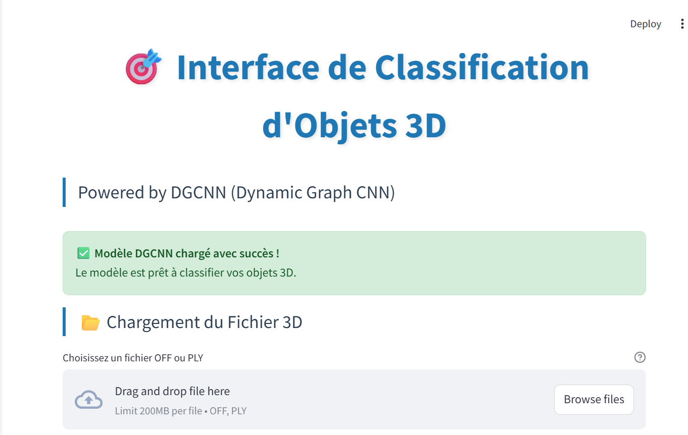

# 🎯 Interface de Classification d'Objets 3D - DGCNN

Une interface web moderne et interactive pour la classification d'objets 3D utilisant le modèle DGCNN (Dynamic Graph CNN).



## 🌟 Fonctionnalités

- **🔮 Classification en temps réel** : Classifiez vos objets 3D instantanément
- **🎨 Visualisation 3D interactive** : Explorez vos nuages de points en 3D
- **📊 Analyse détaillée** : Probabilités par classe et métriques de confiance
- **📁 Formats multiples** : Support des fichiers OFF et PLY
- **💻 Interface moderne** : Interface web responsive et intuitive
- **🎯 10 classes d'objets** : Meubles et objets d'intérieur (ModelNet10)

## 🏷️ Classes Supportées

Le modèle peut classifier les objets suivants :
1. **Bathtub** (Baignoire)
2. **Bed** (Lit)
3. **Chair** (Chaise)
4. **Desk** (Bureau)
5. **Dresser** (Commode)
6. **Monitor** (Moniteur)
7. **Night Stand** (Table de nuit)
8. **Sofa** (Canapé)
9. **Table** (Table)
10. **Toilet** (Toilettes)

## 🚀 Installation Rapide

### Option 1 : Clone depuis GitHub
```bash
# Cloner le repository
git clone https://github.com/YoussefChlih/3d-obj-rec.git
cd 3d-obj-rec

# Lancement automatique (Windows)
launch.bat

# Ou lancement Python
python launch.py
```

### Option 2 : Lancement automatique (Windows)
```bash
# Dans le dossier du projet
launch.bat
```

### Option 3 : Lancement automatique (Python)
```bash
python launch.py
```

### Option 4 : Installation manuelle
```bash
# 1. Installer les dépendances
pip install -r requirements.txt

# 2. Créer les fichiers de démonstration
python create_demo.py

# 3. Lancer l'interface
streamlit run app.py
```

## 📋 Prérequis

- **Python 3.8+**
- **Git** (pour cloner le repository)
- **Modèle entraîné** : `best_dgcnn_model.pth` (généré par le notebook)
- **Dépendances** : Listées dans `requirements.txt`

## 📁 Structure du Projet

```
3d-obj-rec/
├── .gitattributes           # Configuration Git pour les fins de ligne
├── app.py                   # Interface Streamlit principale
├── launch.py                # Script de lancement Python
├── launch.bat               # Script de lancement Windows
├── create_demo.py           # Générateur de fichiers de démonstration
├── requirements.txt         # Dépendances Python
├── best_dgcnn_model.pth    # Modèle DGCNN entraîné
├── DGCNN_3d_obj.ipynb      # Notebook d'entraînement
├── demo_files/             # Fichiers d'exemple générés
│   ├── chair_example.off
│   ├── table_example.ply
│   └── ...
└── README_Interface.md     # Ce fichier
```

## 🔧 Configuration Git

Pour éviter les problèmes de fins de ligne :

```bash
# Configuration globale Git (optionnel)
git config --global core.autocrlf true

# Le fichier .gitattributes gère automatiquement les fins de ligne
```

## 🖥️ Utilisation de l'Interface

### 1. Lancement depuis GitHub
```bash
git clone https://github.com/YoussefChlih/3d-obj-rec.git
cd 3d-obj-rec
launch.bat  # ou python launch.py
```

### 2. Accès à l'interface
Après le lancement, ouvrez votre navigateur à : `http://localhost:8501`

### 3. Chargement d'un fichier
- Cliquez sur **"Browse files"** ou glissez-déposez votre fichier
- Formats supportés : `.off`, `.ply`
- Taille recommandée : 500-5000 points

### 4. Visualisation
- **Vue 3D interactive** : Explorez votre objet en 3D
- **Statistiques** : Nombre de points, dimensions, taille
- **Rotation/Zoom** : Utilisez la souris pour naviguer

### 5. Classification
- Cliquez sur **"🚀 Classifier l'Objet"**
- Obtenez la **classe prédite** et la **confiance**
- Consultez les **probabilités détaillées** par classe

### 6. Analyse des résultats
- **Graphique de confiance** : Barres horizontales des probabilités
- **Tableau détaillé** : Toutes les classes avec leurs scores
- **Indicateur de qualité** : Excellent/Bon/Acceptable/Incertain

## 🔧 Configuration Avancée

### Paramètres du modèle
```python
# Dans app.py, vous pouvez modifier :
DGCNN(num_classes=10, k=20, dropout=0.5)
```

### Préprocessing des points
```python
# Nombre de points utilisés pour la classification
preprocess_points(points, num_points=1024)
```

## 📊 Formats de Fichiers Supportés

### Format OFF (Object File Format)
```
OFF
8 6 0
0.0 0.0 0.0
1.0 0.0 0.0
1.0 1.0 0.0
...
```

### Format PLY (Polygon File Format)
```
ply
format ascii 1.0
element vertex 1000
property float x
property float y
property float z
end_header
0.0 0.0 0.0
1.0 0.0 0.0
...
```

## 🎨 Fichiers de Démonstration

Le script `create_demo.py` génère automatiquement des exemples d'objets 3D :

- **chair_example.off** : Chaise avec dossier et pieds
- **table_example.ply** : Table avec plateau et pieds
- **sphere_example.off** : Sphère (objet rond)

## 🐛 Résolution de Problèmes

### Avertissement Git sur les fins de ligne
```
warning: in the working copy of 'file.ext', LF will be replaced by CRLF
```
**Solution** : Le fichier `.gitattributes` gère automatiquement ce problème.

### Le modèle n'est pas trouvé
```
⚠️ Modèle non trouvé : best_dgcnn_model.pth
```
**Solution** : Exécutez d'abord le notebook `DGCNN_3d_obj.ipynb` pour entraîner et sauvegarder le modèle.

## 📈 Performance

- **Temps de classification** : < 1 seconde
- **Formats supportés** : OFF, PLY
- **Taille max recommandée** : 10,000 points
- **Précision du modèle** : ~92% sur ModelNet10

## 🚀 Déploiement

Pour déployer sur un serveur :

```bash
# Lancer sur une IP spécifique
streamlit run app.py --server.address 0.0.0.0 --server.port 8501

# Ou configurer dans .streamlit/config.toml
```

## 👨‍💻 Contribution

1. Fork le repository
2. Créez une branche : `git checkout -b feature/nouvelle-fonctionnalite`
3. Committez : `git commit -am 'Ajouter nouvelle fonctionnalité'`
4. Push : `git push origin feature/nouvelle-fonctionnalite`
5. Créez une Pull Request

---

**🎯 Bon classement ! Si vous avez des questions, consultez la documentation ou testez avec les fichiers de démonstration.**
